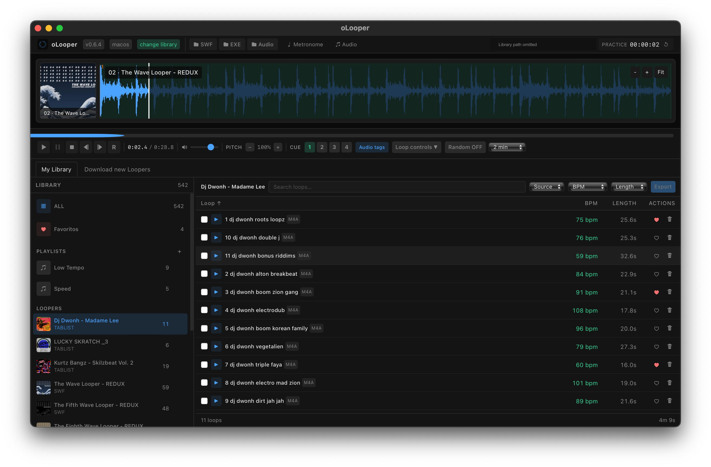
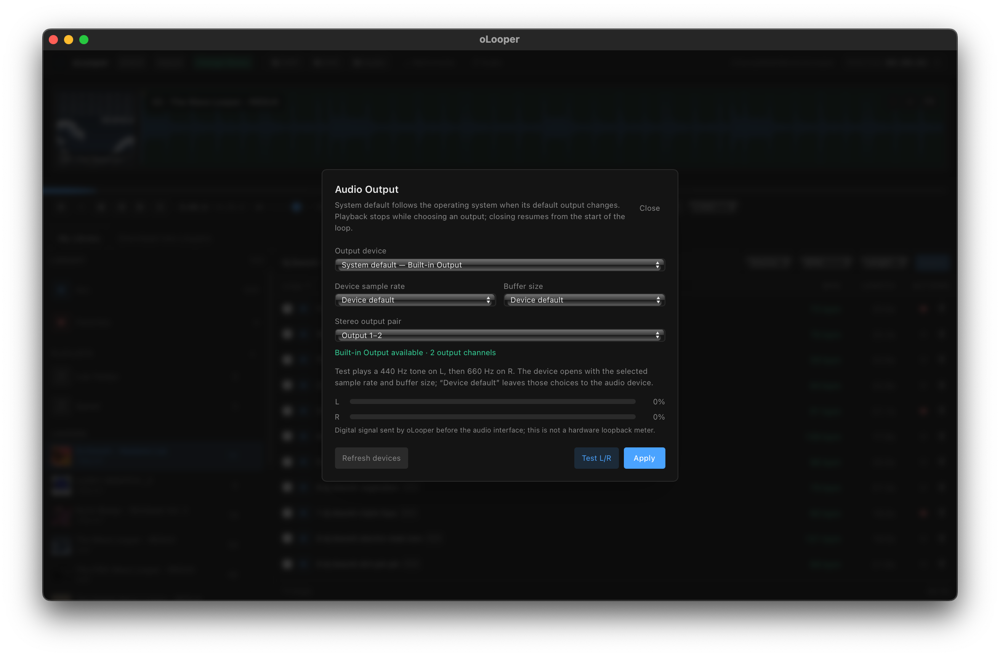
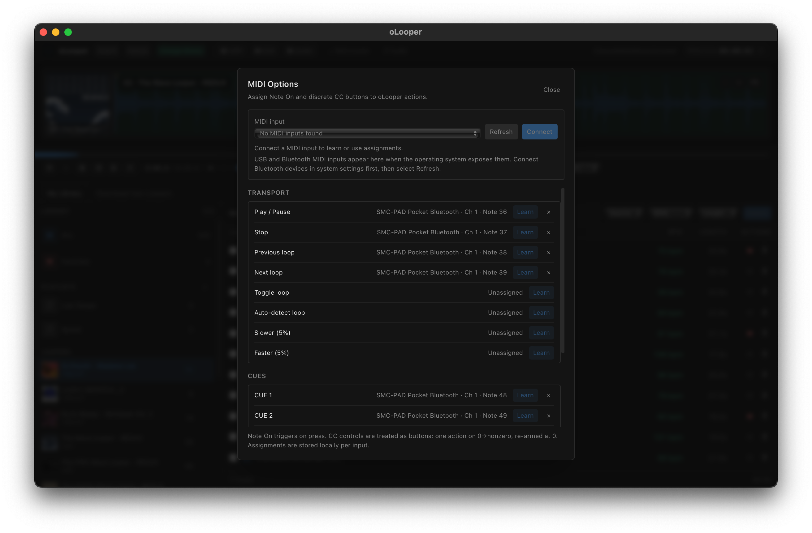

<p align="center">
  
</p>

<h1 align="center">oLooper</h1>

<p align="center"><strong>Your loop library and practice deck, built for scratchers and turntablists.</strong></p>

<p align="center">
  Find the break. Lock the loop. Work on your cuts.<br />
  oLooper turns looper packs and audio into a focused desktop practice setup.
</p>

<p align="center">
  <a href="https://github.com/dknalca/oLooper/releases/tag/v0.6.4"><strong>Download oLooper v0.6.4</strong></a>
  · <a href="https://github.com/dknalca/oLooper/releases">All releases</a>
  · <a href="#what-olooper-does">Explore features</a>
</p>

<p align="center"><strong>macOS 12+ · Windows 11</strong> · Native desktop app · Your library stays on your machine</p>

## Made for scratch practice

Whether you're digging through classic Flash loopers or building a personal crate from audio files, oLooper keeps the material and the practice tools together. Load a break, find its pocket, set cues, slow it down, and run it back—without juggling a browser, media player, and loose folders.

It is designed for **scratch DJs, beat jugglers, and turntablists** who want to spend less time managing loop files and more time practicing.

## Screenshots

<p align="center">
  
</p>
<p align="center"><em>Browse loopers and tracks, inspect waveforms, and adjust Pitch while practicing.</em></p>

<p align="center">
  
</p>
<p align="center"><em>Choose and test the audio output device and stereo pair.</em></p>

<p align="center">
  
</p>
<p align="center"><em>Map MIDI controls to transport, loop, speed, and CUE actions.</em></p>

<p align="center"><sub>Captures from oLooper 0.6.4. The main screenshot's local library path is redacted; example library content and MIDI assignments are shown.</sub></p>

## What oLooper does

### Bring your loopers into one library

- **Import legacy SWF and projector EXE loopers.** Choose to extract embedded MP3/ADPCM tracks or play directly from the source copy. Projector files are parsed as data—oLooper never runs them.
- **Import your own audio.** Add supported audio files by drag-and-drop or file picker; the originals stay where they are.
- **Discover more loopers.** Browse and search the public Tablist catalog, then import a pack or grab a random one.
- **Stay organized.** Browse ALL tracks, make playlists, reorder looper groups, search and filter by BPM, and keep Favorites in your persistent local library.

### Practice the way you want

- **Lock into a loop.** Gapless playback, waveform seeking, manual loop editing, and one-click AUTO loop detection.
- **Work at your pace.** Adjust pitch and playback speed from 50% to 200% in 5% steps.
- **Hit your spots.** CUE 1 returns to the start; save per-track CUE 2–4 for drops, chops, and juggle points.
- **Stay in the session.** Use the practice timer, jump to a random loop, or let timed random practice serve up another library loop. Keep time with the routed metronome.
- **Convert when needed.** Replace a managed WAV with a verified 320 kbps MP3 while retaining the loop's library identity and metadata.
- **Play from your rig.** Map MIDI Note On pads or discrete CC buttons to transport, navigation, loop, speed, AUTO, and cues. USB and Bluetooth MIDI work when the operating system exposes them as inputs.

## Install oLooper

### macOS — Intel and Apple silicon

Download the [macOS v0.6.4 release](https://github.com/dknalca/oLooper/releases/tag/v0.6.4). Its Universal 2 DMG contains native Intel (`x86_64`) and Apple silicon (`arm64`) versions; Rosetta is not required.

1. Open the downloaded `.dmg` and drag **oLooper** into **Applications**.
2. Eject the oLooper disk image, then launch the app from Applications.
3. The DMG is not signed or notarized. On the first launch, Control-click oLooper, choose **Open**, then confirm. If macOS still blocks it, follow [Apple's instructions for opening an app from an unidentified developer](https://support.apple.com/en-us/102445).

The v0.6.4 DMG is built with a **macOS 11.0 (Big Sur) minimum deployment target**. CI verifies the Universal 2 binary and bundle metadata; runtime testing on a Big Sur machine is still pending. No additional runtime or developer tools are needed to install the DMG.

### Windows 11 — x64

Download the [Windows v0.6.4 release](https://github.com/dknalca/oLooper/releases/tag/v0.6.4) and run `oLooper-0.6.4-windows-x64-setup.exe`. Windows 11 includes WebView2 in most installations. If it is missing, install the [Microsoft Edge WebView2 Evergreen Runtime](https://developer.microsoft.com/microsoft-edge/webview2/); the NSIS installer can also bootstrap it when needed. The Windows package is x64.

The unsigned installer may prompt Windows SmartScreen. The app's library and preferences remain in your user profile; installing or removing the app does not delete the selected library.

## Build from source

```bash
pnpm install
pnpm tauri dev
```

For a bundled macOS app, run `./scripts/build.sh`; see the [macOS release notes](docs/macos-release.md). Building on macOS requires [Xcode](https://developer.apple.com/xcode/) (or a [compatible older version](https://developer.apple.com/download/all/?q=Xcode)), [Node.js](https://nodejs.org/en/download/), [pnpm](https://pnpm.io/installation), and [Rust](https://www.rust-lang.org/tools/install).

On Windows, install [App Installer (winget)](https://apps.microsoft.com/detail/9nblggh4nns1) if it is not present. Open PowerShell as Administrator and run `scripts/install-windows.ps1`; it installs Node.js, pnpm, Rust MSVC, Visual Studio C++ Build Tools, and WebView2. Restart PowerShell, then run `scripts/build.ps1` to create `dist/installers/oLooper-0.6.4-windows-x64-setup.exe`. Use `scripts/build.ps1 -Dev` for an unbundled debug executable. The setup script's prerequisites can also be installed individually: [Node.js](https://nodejs.org/en/download/), [pnpm](https://pnpm.io/installation), [Rust](https://www.rust-lang.org/tools/install), and [Visual Studio C++ Build Tools](https://visualstudio.microsoft.com/visual-cpp-build-tools/).

## Checks

```bash
pnpm run typecheck
pnpm test
cargo test --manifest-path src-tauri/Cargo.toml
```

## Project docs

- [Product and feature specifications](specs/)
- [Architecture decisions](docs/adr/)
- [macOS release guide](docs/macos-release.md)
- [Release notes](CHANGELOG.md)

---

<p align="center"><strong>Built for the ones who keep the break going.</strong></p>
