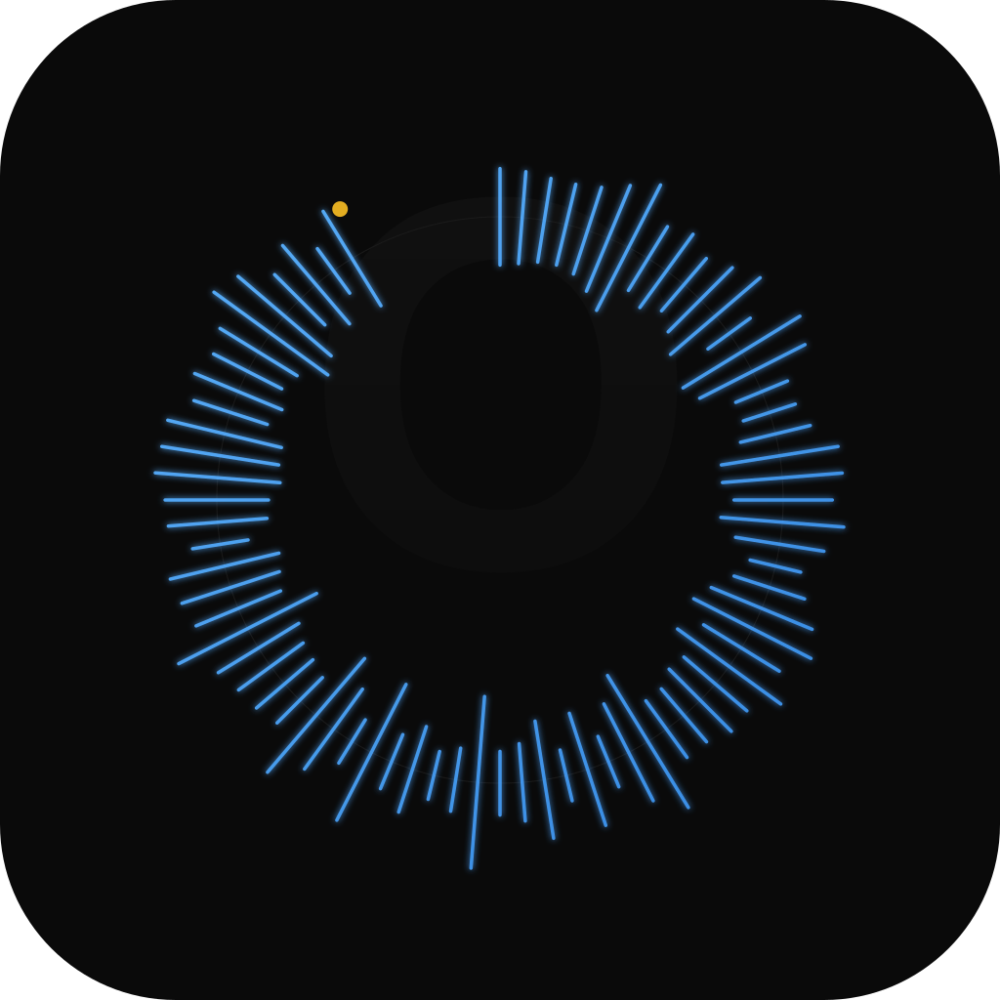

<p align="center">
  
</p>

<h1 align="center">oLooper</h1>

<p align="center"><strong>Your loop library and practice deck, built for scratchers and turntablists.</strong></p>

<p align="center">
  Find the break. Lock the loop. Work on your cuts.<br />
  oLooper turns looper packs and audio into a focused desktop practice setup.
</p>

<p align="center">
  <a href="https://github.com/dknalca/oLooper/releases/latest"><strong>Download the latest release</strong></a>
  · <a href="https://github.com/dknalca/oLooper/releases">All releases</a>
  · <a href="#what-olooper-does">Explore features</a>
</p>

<p align="center"><strong>macOS 12+</strong> · Native desktop app · Your library stays on your machine</p>

## Made for scratch practice

Whether you're digging through classic Flash loopers or building a personal crate from audio files, oLooper keeps the material and the practice tools together. Load a break, find its pocket, set cues, slow it down, and run it back—without juggling a browser, media player, and loose folders.

It is designed for **scratch DJs, beat jugglers, and turntablists** who want to spend less time managing loop files and more time practicing.

## What oLooper does

### Bring your loopers into one library

- **Extract legacy SWF and projector EXE loopers.** Recover embedded MP3 and ADPCM tracks and cover art. Projector files are parsed as data—oLooper never runs them.
- **Import your own audio.** Add supported audio files by drag-and-drop or file picker; the originals stay where they are.
- **Discover more loopers.** Browse and search the public Tablist catalog, then import a pack or grab a random one.
- **Stay organized.** Search tracks, sort by BPM, make Favorites, rename looper groups, and keep a persistent local library.

### Practice the way you want

- **Lock into a loop.** Gapless playback, waveform seeking, manual loop editing, and one-click AUTO loop detection.
- **Work at your pace.** Adjust speed from 50% to 200% in 5% steps; optional pitch lock keeps the key steady.
- **Hit your spots.** CUE 1 returns to the start; save per-track CUE 2–4 for drops, chops, and juggle points.
- **Stay in the session.** Use the practice timer or let timed random practice serve up another library loop.
- **Play from your rig.** Map MIDI Note On pads or discrete CC buttons to transport, navigation, loop, speed, AUTO, and cues. USB and Bluetooth MIDI work when macOS exposes them as MIDI inputs.

## Get oLooper

**[Download the latest macOS release →](https://github.com/dknalca/oLooper/releases/latest)**

The current release provides an unsigned DMG for **macOS 12 or later**; it is not notarized. See the [macOS release notes](docs/macos-release.md). Your catalog and extracted audio are stored in your local library; imported SWF/EXE originals are not altered or removed.

## Build from source

```bash
pnpm install
pnpm tauri dev
```

For a bundled app, run `./scripts/build.sh`. See [macOS release notes](docs/macos-release.md) for packaging details.

## Checks

```bash
pnpm run typecheck
pnpm test
cargo test --manifest-path src-tauri/Cargo.toml
```

## Project docs

- [Product and feature specifications](specs/)
- [Architecture decisions](docs/adr/)
- [macOS release guide](docs/macos-release.md)

---

<p align="center"><strong>Built for the ones who keep the break going.</strong></p>
